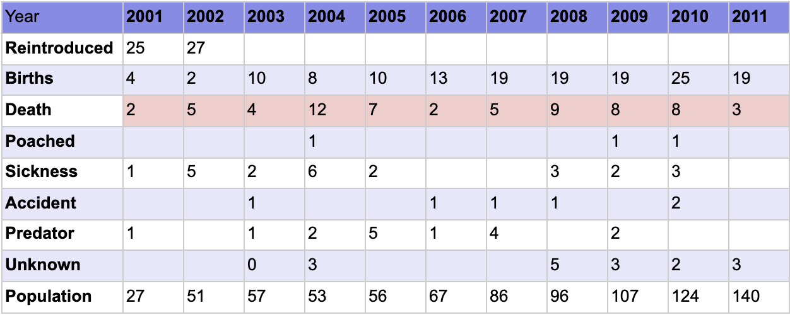

# American-Elk
Simulating American Elk reintroduction into the Great Smokey Mountain National Park

This project is used to simulate the success, defined as long-term growth towards carrying capacity, of the American Elks
with their reintroduction in the Great Smokey Mountain National Park. Data derived from a previous reintroduction
project was taken and used for this simulation. With the combination of adjusting birth rates and death rates
to accomodate for the difference in square footage and other external forces, I have taken an approach to use a 
stochastic model. 

Taking each of the variables as random normal distribution variables, each with its own birth and death rate,
I was able to simulate the elk population's growth in the short term of about a century. 

Technicalities:
- Due to the nature of normal random variables, when negative rates were resulted from the program, a rate of 0% was instead taken
- A display of the deterministic model with hacking is also performed as comparison
- Data taken from previous reintroduction program is as below:

